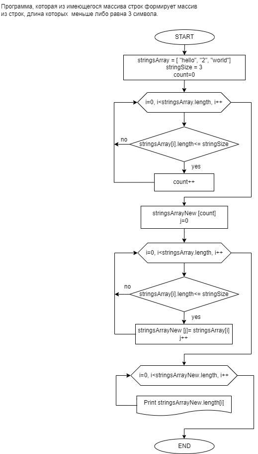

В данном репозитории находятся папки с контрольной работой
по первому этапу программы "Разработчик".

Решение задачи представлено на языках C# и дополнительно Python.  

**Условие задачи:**
Написать программу, которая из имеющегося массива строк формирует массив из строк, длина которых  меньше либо равна 3 символа. Первоначальный массив можно ввести с клавиатуры, либо задать на старте выполнения алгоритма. При решении не рекомендуется пользоваться коллекциями, лучше обойтись исключительно массивами.

**Блок схема алгоритма (для C#):**  
 

 

**Описание алгоритма для С#:** 
1. Задается исходный массив строк
2. В цикле перебираются элементы исходного массива при этом, происходит сравнение длины элемента массива с заданным значением длины. В случае выполнения условия сравнения счетчик инкрементируется.
4. Определяется новый массив длинной равной значению счетчика.
5. В цикле перебираются элементы исходного массива при этом, происходит сравнение длины элемента массива с заданным значением длины. В случае выполнения условия сравнения, элементу нового массива присваивается значение элемента исходного массива, соответствующее условию сравнения.
6. Выводятся элементы нового массива в цикле.

**Описание алгоритма для Python:**
1. Задается исходный список строк
2. Задается пустой новый список для новых строк
3. В цикле перебираются элементы исходного списка при этом, происходит сравнение длины элемента списка с заданным значением длины. В случае выполнения условия сравнения в  конец нового списка добавляется элемент исходного списка, соответствующий условию сравнения.
4. Выводится значения нового списка.
